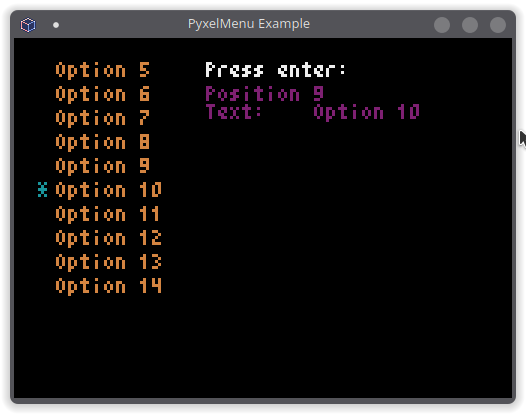
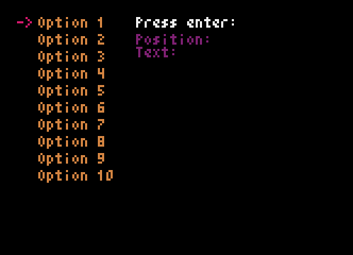

# PyxelMenu

PyxelMenu is a Python class for Pyxel to easily add a menu to your projects.

You can define the options, text and cursor colors, number of options to display, etc.

This project is still under development, so there may be changes in the initializer, as well as in the methods, etc.

[Documentation](https://son-link.github.io/PyxelMenu/)

## Example:

Under MIT license

Copyright (c) 2024 Alfonso Saavedra "Son Link"