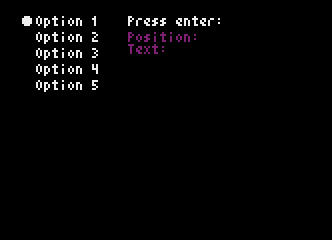

# 001: Default

## Description

This is a basic example, using the default settings



## Code

```python
# Example with default options

import pyxel
from pyxel_menu import PyxelMenu


class Example:
    def __init__(self):
        self.current_text = ''
        self.current_pos = ''
        menu_options = []

        for i in range(1, 21):
            menu_options.append(f'Option {i}')

        self.menu = PyxelMenu(8, 8, menu_options)

        pyxel.init(166, 120, title='PyxelMenu Example 001', display_scale=3)

        pyxel.run(self.update, self.draw)

    def update(self):
        if pyxel.btnp(pyxel.KEY_UP):
            self.menu.move_up()
        elif pyxel.btnp(pyxel.KEY_DOWN):
            self.menu.move_down()

        if pyxel.btnp(pyxel.KEY_RETURN):
            self.current_pos = self.menu.get_current_pos()
            self.current_text = self.menu.get_current_text()

    def draw(self):
        pyxel.cls(0)
        self.menu.draw()
        pyxel.text(64, 8, 'Press enter:', 7)
        pyxel.text(64, 16, f'Position: {self.current_pos}', 2)
        pyxel.text(64, 22, f'Text:     {self.current_text}', 2)


if __name__ == '__main__':
    example = Example()

```