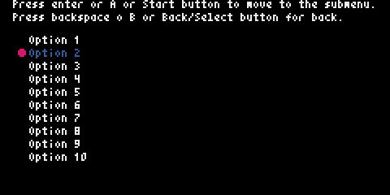

# 006: Submenu

## Description

This is an example of how you can create several instances of PyxelMenu to create menus that interact with each other, one as the main menu and another as a submenu.



## Code

```python
# This is an example of how you can create several instances of PyxelMenu
# to create menus that interact with each other, one as the main menu
# and another as a submenu.

import pyxel
from pyxel_menu import PyxelMenu


class Example:
    def __init__(self):
        self.current_text = ''
        self.current_pos = ''
        menu_options = []
        self.menu_in_use = 1  # 1: Main menu, 2: submenu 

        for i in range(1, 21):
            menu_options.append(f'Option {i}')

        self.menu = PyxelMenu(8, 22, menu_options, 10)
        self.menu.set_cursor(color=8)
        self.menu.set_highlight_color(5)

        self.submenu = PyxelMenu(64, 22, limit=10)
        self.submenu.set_cursor(cursor_type='triangle', color=10)

        pyxel.init(240, 120, title='PyxelMenu Example 006: Submenu')

        pyxel.run(self.update, self.draw)

    def update(self):
        if (
            pyxel.btnp(pyxel.KEY_UP) or
            pyxel.btnp(pyxel.GAMEPAD1_BUTTON_DPAD_UP)
        ):
            if self.menu_in_use == 1:
                self.menu.move_up()
            else:
                self.submenu.move_up()
        elif (
            pyxel.btnp(pyxel.KEY_DOWN) or pyxel.btnp(pyxel.GAMEPAD1_BUTTON_DPAD_DOWN)
        ):
            if self.menu_in_use == 1:
                self.menu.move_down()
            else:
                self.submenu.move_down()
        elif (
            (pyxel.btnp(pyxel.KEY_RETURN) or
            pyxel.btnp(pyxel.GAMEPAD1_BUTTON_A) or
            pyxel.btnp(pyxel.GAMEPAD1_BUTTON_START)) and
            self.menu_in_use == 1
        ):
            self.gen_submenu()
            self.submenu.set_cursor_pos(0)
            self.submenu.set_highlight_color(3)
            self.menu.set_highlight_color(7)
            self.menu_in_use = 2
        elif (
            (pyxel.btnp(pyxel.KEY_BACKSPACE) or
            pyxel.btnp(pyxel.GAMEPAD1_BUTTON_B) or
            pyxel.btnp(pyxel.GAMEPAD1_BUTTON_BACK)) and
            self.menu_in_use == 2
        ):
            self.submenu.set_highlight_color(7)
            self.menu.set_highlight_color(5)
            self.menu_in_use = 1

    def draw(self):
        pyxel.cls(0)
        pyxel.text(8, 0, 'Press enter or A or Start button to move to the submenu.', 7)
        pyxel.text(8, 8, 'Press backspace o B or Back/Select button for back.', 7)
        self.menu.draw()
        self.submenu.draw()

    def gen_submenu(self):
        submenu = []
        for i in range(1, 21):
            submenu.append(f'{self.menu.get_current_text()} - {i}')

        self.submenu.set_options(submenu)


if __name__ == '__main__':
    example = Example()

```